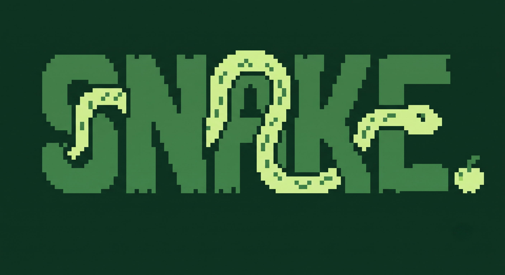
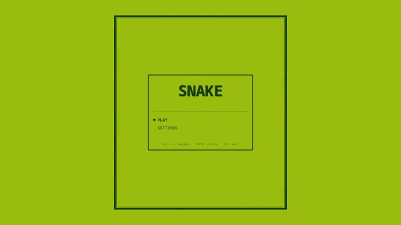

  
  
  # RETROSNAKE
  
  **Production Build: v2.0 — The Final Update!**
  
  
  
  

  *One of the best journeys OAT! Welcome to RetroSnake!*
  
  
  

---

## Engine Architecture & Performance (Changelog)

The UI has been completely restructured into a thick hardware frame featuring a top Header, right Sidebar, and bottom Footer to truly mimic a retro arcade cabinet. The engine has been completely overhauled for maximum performance:

*   **Decoupled Fixed-Timestep Game Loop:** The game engine has been moved off the Swing Event Dispatch Thread onto a dedicated 60 TPS physics thread, providing perfectly deterministic timing without frame stutter.
*   **Zero-Allocation Pipeline & Object Pooling:** Eliminated GC-induced microstutters by utilizing a pre-allocated object pool for particles and caching formatted HUD strings.
*   **Double-Buffered Snapshots:** Implemented a thread-safe `RenderSnapshot` pattern that safely hands game state to the UI renderer without lock contention.
*   **O(1) Collision Detection:** Replaced linear `LinkedList` collision checks with an instantaneously updated 2D boolean grid.
*   **Pre-computed Audio Engine:** Audio clips are now pre-synthesized at startup into memory buffers, guaranteeing zero audio lag or thread-creation churn.
*   **Asynchronous Saves:** High scores are now written to disk via a background daemon thread, preventing disk I/O latency from stalling gameplay.
*   **Cinematic Boot Sequence:** The game now boots into a 1.5-second cinematic splash screen featuring "atharvajshinde studios".

## Controls

| Action | General / UI | Player 1 (1P / 2P) | Player 2 (2P Mode) |
| :--- | :--- | :--- | :--- |
| **Move** | <kbd>W</kbd> <kbd>S</kbd> (Navigate) | <kbd>W</kbd> <kbd>A</kbd> <kbd>S</kbd> <kbd>D</kbd> | <kbd>↑</kbd> <kbd>↓</kbd> <kbd>←</kbd> <kbd>→</kbd> |
| **Dash** | - | <kbd>Q</kbd> / <kbd>L-Shift</kbd> | <kbd>R-Ctrl</kbd> |
| **Start / Select** | <kbd>Space</kbd> / <kbd>Enter</kbd> | - | - |
| **Pause / Resume**| <kbd>P</kbd> | - | - |
| **Restart Game** | <kbd>R</kbd> (on Game Over) | - | - |
| **Quit** | <kbd>ESC</kbd> | - | - |

> *Note: In 1-Player mode, Arrow Keys can also be used to control Player 1!*

## How to Run the Game

All files can be downloaded through the **Releases** section of this repo! Choose the method that works best for you:

1.  **Windows Installer (Highly Recommended!):** Download the `RetroSnake-Windows-Installer.exe` file from the Releases page. Simply double-click the setup file to install the game; it will automatically set up RetroSnake on your computer and create an easy-to-use shortcut.
2.  **Native Executable (Recommended for Linux):** If you downloaded a native build, you don't need to install Java or touch the terminal! Simply extract the folder and double-click the **RetroSnake** application to play.
3.  **Run the Executable JAR:** If you have Java installed on your system, you can run the pre-packaged executable archive. Open your terminal in the project folder and run: `java -jar libs/RetroSnake.jar`
4.  **Compile from Source (For Developers):** Open your terminal in the root project folder. Compile the code: `javac -d bin src/*.java`. Run the game: `java -cp bin SnakeApp`.

## The Game Manual (Spoilers Ahead!)

<b>Click to reveal advanced mechanics & game juice</b>

 

*Warning: It is highly recommended to play the game blind first to experience the surprises yourself!*

*   **Dynamic Scaling & Boards:** Use the settings menu to adjust your screen zoom (1.0x to 3.0x) and choose between Small (16x16), Medium (24x24), and Large (32x32) grids. Larger boards increase the snake's base speed!
*   **Local 2-Player Versus:** Switch to `2-PLAYER` mode in settings! You can crash into the opponent's body to win, or crash head-to-head for a Draw. Watch out for wall collisions!
*   **The Dash System:** Hold the dash key to consume Stamina and move 3x faster! Use this to cut off your opponent or snag the apple first. Stamina regenerates over time.
*   **The Combo System:** Eating apples in quick succession triggers an escalating combo multiplier (x2, x3, x4) tracked by a draining HUD combo bar.
*   **The Leveling System:** For every 5 apples you eat, the game levels up, permanently increasing the snake's speed.
*   **Tactile Feedback:** Experience 60FPS fluid motion featuring screen shake on death, hit-stop micro-pauses on apple bites, rolling pinball score counters, and ghost trails at high combos.

---

  <i>Created by atharvajshinde</i>

